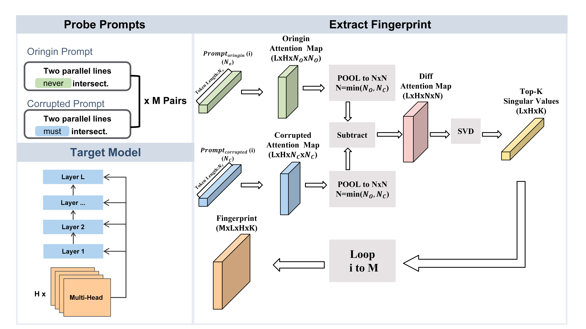
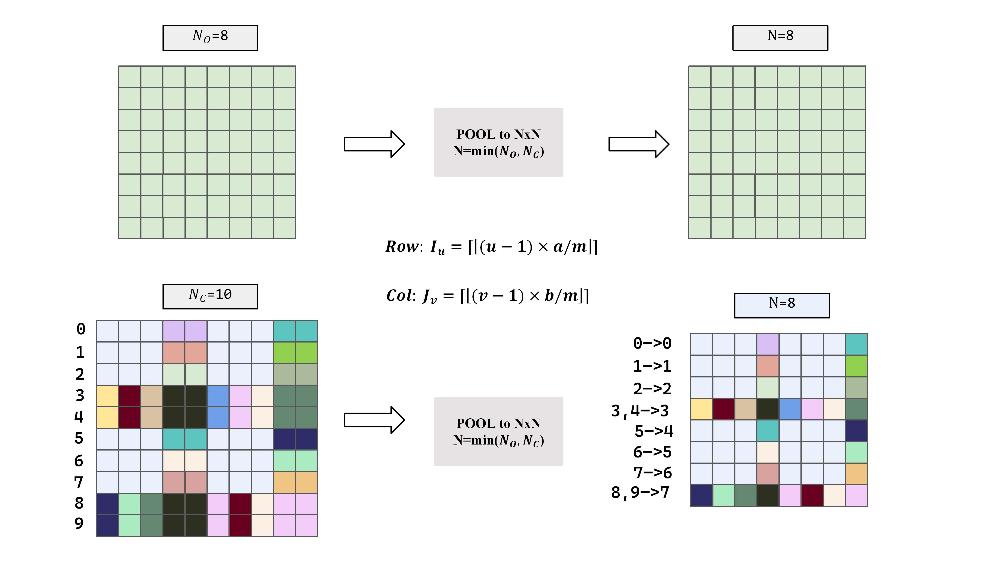

<div align="center">

# AttnDiff: Attention-based Differential Fingerprinting for Large Language Models

[](https://www.python.org/)
[](https://pytorch.org/)
[](https://github.com/huggingface/transformers)
[](LICENSE)
[](https://github.com/yourusername/AttnDiff/actions)

</div>

## Introduction

AttnDiff is a lightweight model fingerprinting method for **model similarity estimation**. Instead of comparing hidden states, AttnDiff builds a fingerprint from **head-level attention differences** under paired prompts (e.g., `original` vs. `corrupted`).

### Pipeline Overview

<div align="center">


</div>

## Quick Start

### Installation

**Option 1: Using uv (Recommended)**

```bash
# Install uv
curl -LsSf https://astral.sh/uv/install.sh | sh

# Clone and install
git clone https://github.com/zhb0119/AttnDiff.git
cd AttnDiff
uv sync
```

**Option 2: Using pip + venv**

```bash
# Clone repository
git clone https://github.com/zhb0119/AttnDiff.git
cd AttnDiff

# Create virtual environment
python -m venv .venv
source .venv/bin/activate
pip install -e .
```

### Basic Usage

**Compare pre-computed fingerprints:**

```bash
uv run attndiff-compare \
  --base output/comput_W/fingerprint_Llama-2-7B.json \
  --dir output/comput_W \
  --cka linear
```

**Compute fingerprint from model:**

```bash
uv run attndiff-compute \
  --model_name meta-llama/Llama-2-7b-hf \
  --attn_device cuda:0 \
  --dataset dataset/dataset.json \
  --out output/comput_W/fingerprint_llama2.json
```

## Table of Contents

- [Installation](#installation)
- [Quick Start](#quick-start)
- [Usage](#usage)
- [Dataset Format](#dataset-format)
- [Repository Structure](#repository-structure)
- [Development](#development)
- [Citation](#citation)
- [License](#license)

## Usage

### Compute Fingerprints

```bash
# From pre-extracted attention files
uv run attndiff-compute \
  --original output/attention/model_att_origin.json \
  --corrupted output/attention/model_att_perturb.json \
  --mode diff \
  --out output/comput_W/fingerprint_model.json

# Extract attention and compute (automatic)
uv run attndiff-compute \
  --model_name your_model_path \
  --attn_device cuda:0 \
  --dataset dataset/dataset.json \
  --mode diff \
  --out output/comput_W/fingerprint_your_model.json
```

**Batch compute for multiple models:**

```bash
# Edit scripts/batch_compute.py to configure model paths
uv run python scripts/batch_compute.py
```

**Arguments:**
- `--model_name`: Model name or local path
- `--original`: Path to original attention JSON
- `--corrupted`: Path to corrupted attention JSON
- `--mode`: `diff` (default), `orig`, or `base`
- `--attn_device`: Device for attention extraction (e.g., `cuda:0`)
- `--out`: Output fingerprint path

### Compare Fingerprints

```bash
# Compare all fingerprints in directory
uv run attndiff-compare \
  --base output/comput_W/fingerprint_base.json \
  --dir output/comput_W \
  --cka linear

# Compare specific layer
uv run attndiff-compare \
  --base output/comput_W/fingerprint_base.json \
  --dir output/comput_W \
  --cka linear \
  --layer 1
```

**Arguments:**
- `--base`: Base fingerprint JSON (required)
- `--dir`: Directory containing fingerprints
- `--cka`: CKA type (`linear`)
- `--layer`: Compare specific layer (1-based, optional)

## Dataset Format

Create `dataset/dataset.json`:

```json
[
  {
    "id": 1,
    "topic": "Mathematics",
    "original": "...",
    "corrupted": "..."
  },
  {
    "id": 2,
    "topic": "Science",
    "original": "...",
    "corrupted": "..."
  }
]
```

## Repository Structure

```
AttnDiff/
├── src/attndiff/          # Package source code
│   ├── core/              # Core algorithms
│   ├── cli/               # CLI tools
│   └── utils/             # Utilities
├── tools/                 # Model manipulation tools
│   ├── model-merging/     # Model merging tools
│   └── model-pruning/     # Model pruning tools
├── scripts/               # Batch processing scripts
├── tests/                 # Unit tests
├── examples/              # Usage examples
├── dataset/               # Dataset directory
├── output/                # Output directory
│   ├── attention/         # Attention files
│   └── comput_W/          # Fingerprints
├── pyproject.toml         # UV/pip configuration
└── README.md
```

## Citation

If you use AttnDiff in your research, please cite:

```bibtex
@article{attndiff2024,
  title={AttnDiff: Attention-based Differential Fingerprinting for Large Language Models},
  author={Your Name},
  journal={arXiv preprint},
  year={2024}
}
```

## Contributing

Contributions are welcome! Please open an issue or pull request on GitHub.

## License

This project is licensed under the MIT License - see the [LICENSE](LICENSE) file for details.

## Acknowledgments

- Built with [PyTorch](https://pytorch.org/)
- Uses [Hugging Face Transformers](https://huggingface.co/transformers)
- Package management with [UV](https://github.com/astral-sh/uv)
