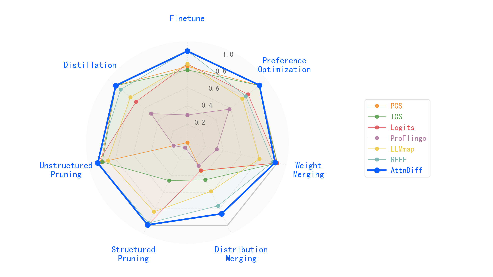
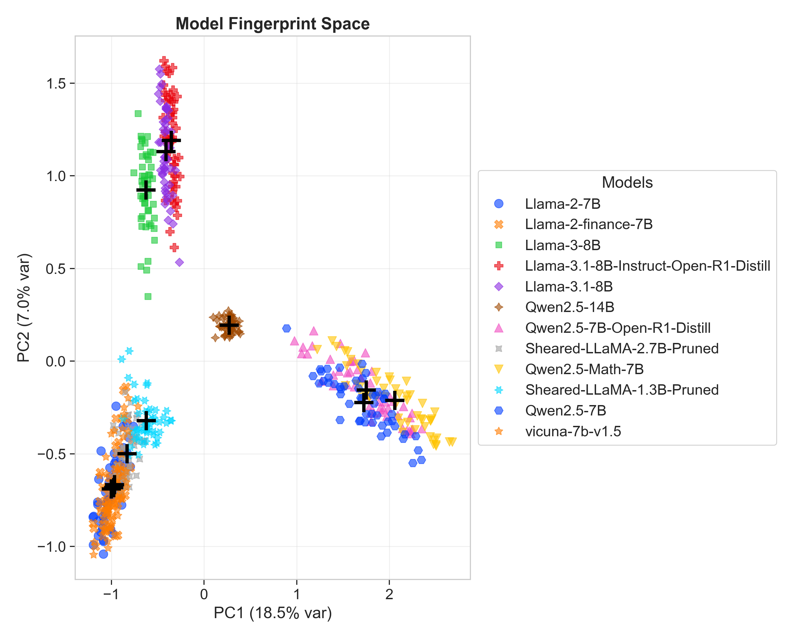

<div align="center">

# AttnDiff: Attention-based Differential Fingerprinting for Large Language Models

[](https://www.python.org/)
[](https://pytorch.org/)
[](https://github.com/huggingface/transformers)
[](https://huggingface.co/)
[](https://numpy.org/)
[](https://scikit-learn.org/stable/)
[](LICENSE)
</div>

## Introduction

AttnDiff is a lightweight model fingerprinting method for **model similarity estimation**.
Instead of comparing hidden states, AttnDiff builds a fingerprint from **head-level attention differences** under paired prompts (e.g., `original` vs. `corrupted`).

### Pipeline overview

<div align="center">


</div>

### Multi-dimensional evaluation

<div align="center">



</div>

### Example: similarity-driven clustering

<div align="center">



</div>

## Quick Start

- We have pre-released fingerprints from models encountered in our experiments to facilitate reproducibility. Run `compare_fingerprints.py` directly using these fingerprints under `output/comput_W/`.
- **Full pipeline**: batch-generate attentions and fingerprints via `pipeline/generate.sh`, then compute similarity using `compare_fingerprints.py`.

## Table of Contents

- [Introduction](#introduction)
- [Quick Start](#quick-start)
- [Overview](#overview)
- [Fastest Reproduction (Using Released Fingerprints)](#fastest-reproduction-using-released-fingerprints)
- [End-to-End Pipeline](#end-to-end-pipeline)
- [Argument Reference](#argument-reference)
- [Repository Layout](#repository-layout)
- [Troubleshooting](#troubleshooting)
- [Model List](#model-list)

## Overview

This repository provides a lightweight and reproducible pipeline for:

- **Attention extraction**: extract attention tensors for paired prompts (`original` vs. `corrupted`).
- **Fingerprint construction**: compute head-level attention differences and derive high-dimensional fingerprints (`compute_W.py`).
- **Similarity evaluation**: compute similarity between fingerprints across models (`compare_fingerprints.py`), supporting linear CKA.

A set of **released fingerprints** is provided under `output/comput_W/`, enabling you to reproduce similarity results without running large models.

## Fastest Reproduction (Using Released Fingerprints)

This is the most lightweight entry point: **no attention extraction and no model inference required**.

### 1) Environment


```bash
python -m venv .venv
```

Activate the environment:


- **Windows (PowerShell)**

```bash
.venv\Scripts\Activate.ps1
```

- **Linux/macOS**

```bash
source .venv/bin/activate
```

Install dependencies:


```bash
pip install -r requirements.txt
```

### 2) Run Fingerprint Similarity (Linear CKA)


Use the released fingerprints under `output/comput_W/`:


```bash
python compare_fingerprints.py \
  --base output/comput_W/fingerprint_Llama-2-7B.json \
  --dir  output/comput_W \
  --cka  linear
```

You will see:


- **Automatic loading** of all `fingerprint_*.json` in `--dir` (ensuring `--base` is included in the comparison set).
- **Pairwise similarity** between the base fingerprint and other models.


Optional:


- **Linear CKA**
- **Compare a single layer** (`--layer` is 1-based) with linear CKA


```bash
python compare_fingerprints.py \
  --base output/comput_W/fingerprint_Llama-2-7B.json \
  --dir  output/comput_W \
  --cka  linear \
  #--layer 1
```

## End-to-End Pipeline

The end-to-end workflow is:

1. **Prepare a dataset** of paired prompts (`original` / `corrupted`).
2. **Generate attentions and fingerprints**: for a single model using `compute_W.py`, or for multiple models via `pipeline/generate.sh`.
3. **Compute similarity** using `compare_fingerprints.py`.

### Step 1) Dataset Format


When attention extraction is enabled, `compute_W.py` reads by default:


`dataset/dataset.json`

Each record has the following schema:


```json
{
  "id": 1,
  "topic": "Mathematics",
  "original": "...",
  "corrupted": "..."
}
```

### Step 2) Fingerprint Construction (Single Model)


`compute_W.py` generates (or loads) two attention JSON files:


- `output/attention/<model>_att_origin.json`
- `output/attention/<model>_att_perturb.json`

It then writes the fingerprint to:


- `output/comput_W/fingerprint_<model>.json`

Example:


```bash
python compute_W.py \
  --model_name your_model_or_local_path \
  --mode diff \
  --attn_device cuda:0 \
  --out output/comput_W/fingerprint_your_model.json
```

Notes:


- **Relative paths** are supported; they are resolved relative to the directory containing `compute_W.py` (not your shell working directory).
- If attention files are missing, it will attempt to invoke `tool/extract_attentions.py` and use `dataset/dataset.json` for automatic generation.

### Step 3) Batch Generation (Multiple Models)


Edit and run:


- `pipeline/generate.sh`

The script iterates over `MODELS` and invokes `compute_W.py` once per model.


You need to update:


- **`BASE_PATH`**: your local model root directory.
- **`MODEL_PATHS[...]`**: mapping (model_name → absolute/relative path).
- **`MODELS=(...)`**: list of model names to run.
- **`ATTN_DEVICE`**: device for attention extraction (e.g., `cuda:0`).


Run (Linux/macOS/Git Bash/WSL):


```bash
bash pipeline/generate.sh
```

Windows note:

- It is recommended to use **Git Bash** or **WSL**. PowerShell/CMD may fail due to Bash syntax incompatibilities.


## Argument Reference


### `compute_W.py` (Fingerprint Construction)


Common arguments:


- `--model_name`: model name or local path (used to derive default output names).
- `--original`, `--corrupted`: attention JSON paths.
- `--out`: output fingerprint JSON path.
- `--mode`: `diff` (default), `orig`, `base`.
- `--attn_device`: device for attention extraction (e.g., `cuda:0` / `cpu`).


### `compare_fingerprints.py` (Similarity Evaluation)


Core arguments:


- `--base`: base fingerprint JSON path (**required**).
- `--dir`: directory of fingerprints to compare (default: `output/comput_W`; loads `fingerprint_*.json`).
- `--cka`: `linear` (only linear CKA supported).
- `--kernel_gamma_scale`: used only for `--cka kernel`.
- `--layer`: compare a specific layer only (1-based).
- `--mode`: `cka` (default, linear CKA only).


Important constraints:


- All fingerprints involved in one comparison must share the **same representation type** (e.g., all `fingerprint_vector`, or all `per_sample_scores` / `per_sample_svd` / `per_sample_ars` / `per_sample_log_bucket`, etc.).
- For linear CKA comparisons, sample counts must match (same `N_global` / same `M`).


## Repository Layout


```text
AttnDiff/
  compute_W.py
  compare_fingerprints.py
  pipeline/generate.sh
  tool/extract_attentions.py
  dataset/
    dataset.json
  output/
    comput_W/
      fingerprint_*.json
```

## Troubleshooting


- **Automatic attention extraction fails**:
  - Ensure `dataset/dataset.json` exists.
  - Ensure `tool/extract_attentions.py` can be imported.
  - Verify package versions in `requirements.txt` (`torch` / `transformers` / `accelerate`, etc.).

## Model List

### A. Model taxonomy (Category / Type / Base / Suspects)

| Category | Type | Base (Victim) | Suspect(s) / Derivative(s) |
|---|---|---|---|
| Fine-tuning | Instruction | Llama-2-7B | Llama-2-instance-7b<br>Vicuna-1.5-7b<br>WizardMath-7b<br>Chinese-LLaMA-2-7b<br>CodeLLaMA-7b<br>Llemma-7b |
| Merge | Weight | Shisa-gamma-7b-v1<br>WizardMath-7b-1.1<br>Abel-7b-002 | Evolllm-jp-7b |
| Dist./Behav. |  | Llama-2-7B<br>OpenLLaMA-2-7b<br>mpt-7b | FuseLlm-7b |
| Pruning | Structured | Llama-2-7B | Sheared-llama-1.3b<br>Sheared-llama-1.3b-sharegpt<br>Sheared-llama-1.3b-pruned<br>Sheared-llama-2.7b<br>Sheared-llama-2.7b-pruned |
| Pruning | Unstructured | Llama-2-7B | Sparse-llama-2-7b<br>Wanda-llama-2-7b<br>GBLM-llama-2-7b |
| Pref. Opt. | PPO/DPO | Llama-2-7B | llama-2-7b-ppo-v0.1-reward<sup>1</sup><br>llama-2-7b-ppo-v0.1-policy<sup>1</sup><br>tulu-2-dpo-7b<sup>2</sup><br>llama2-7b-dpo-v1<sup>3</sup> |
| Add. Pruning | LLMPruner | Llama-2-7B<br>Qwen2.5-7B | Random, L1, L2, Taylor (unstructured) |
| Distill | Reasoning | Llama-3.1-8B<br>Qwen2.5-7B<br>Qwen2.5-14B | Llama-3.1-8B-Instruct-Open-R1-Distill<sup>4</sup><br>Qwen2.5-7B-Open-R1-Distill<sup>5</sup><br>DeepSeek-R1-Distill-Qwen-14B<sup>6</sup> |
| Distill | Logit-based | Llama-2-7B | llama-2-7b-logit-watermark-distill-kgw-k1-gamma0.25-delta2<sup>7</sup> |
| Quantization | GPTQ | Qwen2.5-7B<br>Llama-2-7B<br>Llama-3.1-8B<br>Mistral-7B-v0.3 | Qwen2.5-7B-Instruct-GPTQ-Int8<sup>8</sup><br>Qwen2.5-7B-Instruct-GPTQ-Int4<sup>9</sup><br>Llama-2-7B-Chat-GPTQ<sup>10</sup><br>Meta-Llama-3.1-8B-Instruct-GPTQ_Q_8<sup>11</sup><br>LLama-3.1-8B-Instruct-INT4-GPTQ<sup>12</sup><br>Mistral-7B-Instruct-v0.3-GPTQ-4bit<sup>13</sup> |
| Cross-Scale | Qwen2.5 | Qwen2.5-7B<br>Qwen2.5-14B | Qwen2.5-Coder-1.5B<sup>14</sup><br>Qwen2.5-Math-1.5B<sup>15</sup><br>Qwen2.5-1.5B-Instruct<sup>16</sup><br>Qwen2.5-14B-Instruct<sup>17</sup><br>oxy-1-small<sup>18</sup><br>Qwen2.5-14B-Gutenberg-Instruct-Slerpeno<sup>19</sup> |
| Cross-Scale | Gemma-2 | gemma-2-2b | gemma-2-2b-neogenesis-ita<sup>20</sup><br>gemma-2-baku-2b<sup>21</sup><br>gemma2-2b-merged<sup>22</sup> |
| Cross-Scale | Mistral | Mistral-7B-v0.3 | AQUA-7B<sup>23</sup><br>spellcheck-mistral-7b<sup>24</sup><br>Mistral-7B-Instruct-demi-merge-v0.3-7B<sup>25</sup> |
| MoE | Mixtral | Mixtral-8x7B | Instruct_Mixtral-8x7B-v0.1_Dolly15K<sup>26</sup><br>Nous-Hermes-2-Mixtral-8x7B-DPO<sup>27</sup><br>openbuddy-mixtral-8x7b-v15.4<sup>28</sup> |
| Ablation | Related | Llama-2-7B | CodeLlama-7b<br>Llama-2-finance-7B<br>Vicuna-7b-v1.5<br>Chinese-Llama-2-7b<br>WizardMath-7B-V1.0<br>llemma-7b<br>Sheared-LlaMA-1.3B<br>Sheared-LlaMA-1.3B-Pruned<br>Sheared-LlaMA-1.3B-ShareGPT<br>Sheared-LlaMA-2.7B<br>Sheared-LlaMA-2.7B-Pruned<br>Sheared-LlaMA-2.7B-ShareGPT<br>Sparse-llama-2-7b<br>Wanda-llama-2-7b<br>GBLM-llama-2-7b |
| Ablation | Unrelated | Llama-2-7B | Llama3-8B<br>mpt-7b<br>Qwen2.5-1.5B<br>Qwen2.5-3B<br>Qwen2.5-7B<br>Qwen2.5-14B<br>Qwen2.5-Math-7B<br>gemma-2-2b<br>Gemma-7B-it<br>Yi-6B |
| Pilot | Discovery/Validation | Llama-2-7B | Llama-2-7B<br>CodeLlama-7b-hf<br>WizardMath-7B-V1.0<br>llemma-7b<br>Qwen2.5-7B |

### B. Repository URLs (superscript IDs)

| ID | Repository URL |
|---:|---|
| 1 | https://huggingface.co/renyiyu/llama-2-7b-ppo-lora-v0.1 |
| 2 | https://huggingface.co/allenai/tulu-2-dpo-7b |
| 3 | https://huggingface.co/mncai/llama2-7b-dpo-v1 |
| 4 | https://huggingface.co/asas-ai/Llama-3.1-8B-Instruct-Open-R1-Distill |
| 5 | https://huggingface.co/erickrus/Qwen2.5-7B-Open-R1-Distill |
| 6 | https://huggingface.co/deepseek-ai/DeepSeek-R1-Distill-Qwen-14B |
| 7 | https://huggingface.co/cygul/llama-2-7b-logit-watermark-distill-kgw-k1-gamma0.25-delta2 |
| 8 | https://huggingface.co/Qwen/Qwen2.5-7B-Instruct-GPTQ-Int8 |
| 9 | https://huggingface.co/Qwen/Qwen2.5-7B-Instruct-GPTQ-Int4 |
| 10 | https://huggingface.co/TheBloke/Llama-2-7B-Chat-GPTQ |
| 11 | https://huggingface.co/iqbalamo93/Meta-Llama-3.1-8B-Instruct-GPTQ_Q_8 |
| 12 | https://huggingface.co/DaraV/LLama-3.1-8B-Instruct-INT4-GPTQ |
| 13 | https://huggingface.co/RedHatAI/Mistral-7B-Instruct-v0.3-GPTQ-4bit |
| 14 | https://huggingface.co/Qwen/Qwen2.5-Coder-1.5B |
| 15 | https://huggingface.co/Qwen/Qwen2.5-Math-1.5B |
| 16 | https://huggingface.co/Qwen/Qwen2.5-1.5B-Instruct |
| 17 | https://huggingface.co/Qwen/Qwen2.5-14B-Instruct |
| 18 | https://huggingface.co/oxya/oxy-1-small |
| 19 | https://huggingface.co/v000000/Qwen2.5-14B-Gutenberg-Instruct-Slerpeno |
| 20 | https://huggingface.co/anakin87/gemma-2-2b-neogenesis-ita |
| 21 | https://huggingface.co/rinna/gemma-2-baku-2b |
| 22 | https://huggingface.co/vonjack/gemma2-2b-merged |
| 23 | https://huggingface.co/KurnmaAI/AQUA-7B |
| 24 | https://huggingface.co/openfoodfacts/spellcheck-mistral-7b |
| 25 | https://huggingface.co/grimjim/Mistral-7B-instruct-demi-merge-v0.3-7B |
| 26 | https://huggingface.co/Brillbits/Instruct_Mixtral-8x7B-v0.1_Dolly15K |
| 27 | https://huggingface.co/NousResearch/Nous-Hermes-2-Mixtral-8x7B-DPO |
| 28 | https://huggingface.co/openbuddy/openbuddy-mixtral-8x7b-v15.4 |
